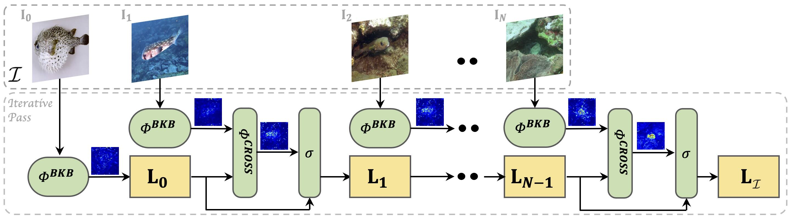

# Self-Supervised Incremental Learning of Object Representations from Arbitrary Image Sets - WACV 2025 - Official Repository 
_*George Leotescu***, *Alin-Ionut Popa***, Diana Grigore, Daniel Voinea, Pietro Perona_
** equal contribution

This repository is the official implementation of [MILE](https://www.amazon.science/publications/self-supervised-incremental-learning-of-object-representations-from-arbitrary-image-sets). 


> This repository presents the implementation of a novel framework for generating holistic embeddings of visual concepts from multiple images using self-supervised learning (SSL). Key features include:
>*  a structured multi-image embedding via sequential latent space modeling
>* an incremental object representation update mechanism
>* an SSL training framework adapted for multi-image inputs. 
>
>The approach introduces a new formulation of object retrieval based on image sets and overcomes geometrical constraints imposed by rigid objects in multi-image setups. Validated on the ABO and iNaturalist datasets, the framework outperforms competitive self and weakly supervised methods in object retrieval tasks. It utilizes ViT family backbones but is compatible with any image encoder. The multi-image approach accommodates various visual distributions of the same object without viewpoint consistency constraints, making it more flexible than traditional multi-view setups. This implementation aims to learn from a broader and more diverse training set, avoiding the limitations of contrastive learning approaches that require numerous images per object.

## Requirements

To install the dependencies:

```
conda create -n MILE python=3.9
conda activate MILE
pip install -r requirements.txt
```


## Data Preparation

### Amazon Berkeley Objects (ABO) Dataset

To download and preprocess the data:

```eval
cd ./data_processing/abo
bash download_raw_data.sh
python abo_preprocess.py
```

*This will generate the data splits for the original [CVPR22 Multi-View Retrieval experiments](!https://openaccess.thecvf.com/content/CVPR2022/html/Collins_ABO_Dataset_and_Benchmarks_for_Real-World_3D_Object_Understanding_CVPR_2022_paper.html)*

The default output location is:
```eval
./data_preprocesing/abo/abo_raw_data/inference_by_class
```

### iNaturalist

To download and preprocess the data:

```
cd ./data_processing/inat
bash download_raw_data.sh
python inat_preprocess.py
```

The default output location is:
```eval
./data_preprocesing/inat/inat_raw_data/inference_by_class
```
## Training

```eval
# OVERRIDE CKPT_ROOT and DATA_PATH with local paths

DATA_PATH=/large_shared/cosine-asin-image-similarity/train_wo_per_asin_case_data_dedupe_gt4_unique_vitl
python train_MILE.py --data_path $DATA_PATH --saveckp_freq 1 --arch dinov2 --model_name dinov2_vitl14_reg --view multi-view --out_dim 65536 --norm_last_layer False --warmup_teacher_temp 0.04 --teacher_temp 0.07 --warmup_teacher_temp_epochs 0 --lr 6.25e-07 --momentum_teacher 0.996 --patch_size 14 --epochs 20 --batch_size_per_gpu 3 --gate_tanh on --peft on --output_dir ./test/tmp/
```

## Inference 

To perform inference with MILE on the **ABO** dataset, run:


```eval
CKPT_ROOT=./test/ckpts/
DATA_PATH=./data_preprocesing/abo/abo_raw_data/inference_by_class
python inference_MILE.py --local_run  --ckpt_root $CKPT_ROOT  --dataset_name Abo_retrieval_test  --test_source test.query  --target_source test.target  --patch_size 14  --view multi-view  --output_type latent  --k_max 10  --data_path  $DATA_PATH --peft on  --arch dinov2  --samples_per_class 4  --model_name blrp-dinov2-vitl14-reg-lora0-fw-5e-06-mt09996-bs3-800 --ckpt_name checkpoint0390.pth
```

To perform inference with MILE on the **iNaturalist** dataset, run:

```eval
CKPT_ROOT=./test/ckpts/
DATA_PATH=./data_preprocesing/inat/inat_raw_data/inference_by_class
python inference_MILE.py --local_run  --ckpt_root $CKPT_ROOT  --dataset_name iNaturalist_100  --test_source query  --target_source target  --patch_size 16  --view multi-view  --output_type latent  --k_max 10  --data_path $DATA_PATH  --subset_classes 100  --arch maws  --peft on  --samples_per_class 4  --base_model_name vit_h14_maws  --model_name blrp-vit-h14-maws-nat-lora0-fw-5e-06-mt09996-bs2-8000 --ckpt_name checkpoint2475.pth
```

To validate your setup, run the following test:
```eval
cd ./test
bash test.sh

ABO: 85.90
iNat: 95.05
```

## Models

You can download our trained models from our [HuggingFace repository](https://huggingface.co/AmazonScience/MILE/).

## Results

Our model achieves the following performance on :


### iNaturalist 

| | Model | Architecture | AR@10 |
|:---:|:---|:---:|:---:|
| Single-Image | DINO [1] | ViT-S | 67.2 |
| | EvaClip [2] | ViT-B | 80.85 |
| | EvaClip [2] | ViT-L | 84.71 |
| | DINOv2 [3] | ViT-S | 77.21 |
| | DINOv2 [3] | ViT-B | 82.79 |
| | DINOv2 [3] | ViT-L | 84.81 |
| | DINO-REG [4] | ViT-L | 84.15 |
| | *ft*-MAWS [5] | ViT-B | 83.90 |
| | *ft*-MAWS [5] | ViT-L | 85.27 |
| | **_ft_-MAWS** [5] | **ViT-H** | **86.40** |
| Multi-Image | MILE w. DINOv2 | ViT-S | 77.77 |
| | MILE w. DINOv2 | ViT-B | 86.57 |
| | MILE w. DINOv2 | ViT-L | 90.96 |
| | MILE w. DINO-REG | ViT-L | 93.2 |
| | MILE w. MAWS | ViT-B | 85.85 |
| | MILE w. MAWS | ViT-L | 90.71 |
| | **MILE w. MAWS** | **ViT-H** | **94.02** |

**iNaturalist Category Retrieval Results.** MILE w. MAWS (ViT-Huge) outperforms all single-image baselines significantly. The *ft* prefix indicates MAWS baselines pre-fine-tuned on iNaturalist. Our method excels across all metrics, demonstrating robustness to structural variations and background shifts in matched object classes.

### ABO

| | Model | Architecture | AR@10 |
|:---:|:---|:---:|:---:|
| Single-Image | DINO [1] | ViT-S | 47.38 |
| | DINO [1] | ViT-S | 57.9 |
| | EvaClip [2] | ViT-B | 48.13 |
| | EvaClip [2] | ViT-L | 55.43 |
| | DINOv2 [3] | ViT-S | 57.40 |
| | DINOv2 [3] | ViT-B | 61.5 |
| | DINOv2 [3] | ViT-L | 66.93 |
| | *ft*-DINOv2 [3] | ViT-L | 80.49 |
| | DINO-REG [4] | ViT-L | 70.81 |
| | ***ft*-DINO-REG** [4] | **ViT-L** | **84.72** |
| | MAWS [5] | ViT-B | 47.81 |
| | MAWS [5] | ViT-L | 48.54 |
| | MAWS [5] | ViT-H | 47.04 |
| Multi-Image | MILE w. DINO | ViT-S | 63.25 |
| | MILE w. DINOv2 | ViT-S | 65.8 |
| | MILE w. DINOv2 | ViT-B | 76.61 |
| | MILE w. DINOv2 | ViT-L | 79.66 |
| | **MILE w. DINO-REG** | **ViT-L** | **86.33** |
| | MILE w. MAWS | ViT-B | 72.51 |
| | MILE w. MAWS | ViT-L | 82.51 |
| | MILE w. MAWS | ViT-H | 81.65 |

**ABO Object Retrieval Results.** Prefix *ft* denotes the fine-tuned version of the single-image model setup on ABO. We fine-tuned only to the best performing pretrained backbones. All approaches are self-supervised except EvaClip, which uses weak-supervision in the form of image and text pairs. Our approach achieves superior performance for the AR@10 metric, thus proving robustness to setups where the structure of the matched object suffers changes between query and gallery visual content.

## Security

See [CONTRIBUTING](CONTRIBUTING.md#security-issue-notifications) for more information.

## License 
This project is released under the CC-BY-NC 4.0 license. See [LICENSE](LICENSE) for more details. 

## Acknowledgement
This repository is based on the [DINO repository](https://github.com/facebookresearch/dino). All modified DINO-related code has been consolidated within the ```dino``` directory, accompanied by the necessary licensing details and attributions.


## Citation

```bibtex
@inproceedings{leotescu2024mile,
  title={Self-Supervised Incremental Learning of Object Representations from Arbitrary Image Sets},
  author={Leotescu, George and Popa, Alin-Ionut Popa and Grigore, Diana and Voinea, Daniel and Perona, Pietro},
  booktitle={Proceedings of WACV},
  year={2025}
}
```
